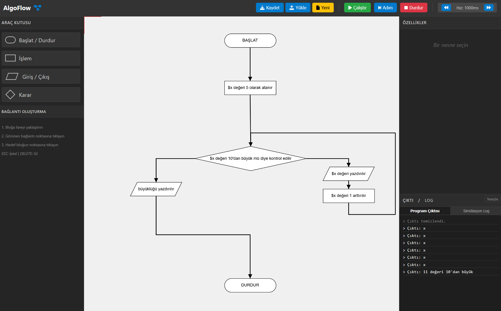

# Algoritma Akış Diyagramı Simülatörü 🚀

Web tabanlı, görsel programlama mantığını öğretmek ve test etmek amacıyla geliştirilmiş, interaktif bir akış diyagramı editörü ve simülatörü.



## 🌟 Özellikler

*   **Görsel Editör:** Sürükle-bırak mantığı ile akış şemaları oluşturun.
*   **Şekil Kütüphanesi:**
    *   🔵 **Başlat/Durdur:** Programın başlangıç ve bitiş noktaları.
    *   ▭ **İşlem:** Matematiksel hesaplamalar ve değişken atamaları.
    *   ▱ **Giriş/Çıkış:** Kullanıcıya veri gösterme veya veri alma.
    *   ◇ **Karar:** Koşullu ifadeler (If/Else) ve döngüler.
*   **Akıllı Bağlantılar:**
    *   Blokları oklarla birbirine bağlayın.
    *   Bağlantı noktalarını ve çizgileri sürükleyerek düzenleyin.
    *   Otomatik hizalama (Snapping) ile düzgün çizgiler elde edin.
    *   Birden fazla girişe izin veren geliştirilmiş bağlantı mantığı.
*   **Değişken Sistemi (PHP Tarzı):**
    *   `$degisken` formatı ile değişken tanımlama ve kullanma.
    *   Metin içi değişken yerleşimi (Interpolation): `"Sonuç: $x"`
*   **Canlı Simülasyon:**
    *   Algoritmayı adım adım veya otomatik çalıştırın.
    *   Ayarlanabilir simülasyon hızı.
    *   Değişkenlerin ve çıktıların anlık takibi.
*   **Dosya Yönetimi:**
    *   Projelerinizi `.json` formatında bilgisayarınıza kaydedin.
    *   Daha sonra kaldığınız yerden devam etmek için dosyayı geri yükleyin.
*   **Kullanıcı Dostu Araçlar:**
    *   Geri Al / Yinele (Undo/Redo)
    *   Yakınlaştırma / Uzaklaştırma (Zoom)
    *   Sınırsız çalışma alanı (Panning)
    *   Blok boyutlandırma

## 🚀 Kurulum ve Çalıştırma

Bu proje tamamen istemci taraflı (client-side) çalışır. Herhangi bir kuruluma ihtiyaç duymaz.

1.  Projeyi indirin (`git clone` veya ZIP olarak).
2.  Klasör içindeki `index.html` dosyasını favori tarayıcınızda (Chrome, Firefox, Edge vb.) açın.
3.  Simülatör kullanıma hazır!

## 📖 Kullanım Kılavuzu

### Değişken Kullanımı
Değişkenler PHP mantığına benzer şekilde **$** işareti ile başlamalıdır.

*   **Atama (İşlem Bloğu):**
    ```php
    $sayi = 10
    $toplam = $sayi + 5
    $isim = "Ahmet"
    ```

*   **Çıktı (Giriş/Çıkış Bloğu):**
    *   Değişken yazdırma: `$onuc`
    *   Metin yazdırma: `"Merhaba Dünya"` veya `Merhaba Dünya`
    *   Karma kullanım: `"Sayının değeri: $sayi"` veya `$sayi sayısı 10'dan büyüktür`

*   **Koşul (Karar Bloğu):**
    *   `$x > 5`
    *   `$sayac == 10`
    *   `$a != $b`

### Kısayollar ve Kontroller
*   **Sol Tık:** Blok seçme / taşıma.
*   **Ok Sürükleme:** Bağlantı noktalarından tutup başka bir bloğa sürükleyin.
*   **Kenar Sürükleme:** Seçili bloğun kenarındaki kutucuklardan boyutunu değiştirin.
*   **ESC:** Seçimi kaldır / Bağlantı çizmeyi iptal et.
*   **Delete:** Seçili bloğu veya bağlantıyı sil.
*   **Orta Tuş (veya Boşluğa Basılı Tutarak):** Çalışma alanını kaydır (Pan).

## 🛠️ Teknolojiler

*   **HTML5 / CSS3:** Arayüz ve stil.
*   **JavaScript (Vanilla):** Uygulama mantığı.
*   **p5.js:** Canvas çizim işlemleri ve grafik motoru.
*   **Bootstrap:** Kullanıcı arayüzü bileşenleri.

## 🤝 Katkıda Bulunma

Hataları bildirmek veya özellik eklemek için "Issues" kısmını kullanabilir veya bir "Pull Request" gönderebilirsiniz.

---
*Geliştirici Notu: Bu proje algoritma öğrenimini kolaylaştırmak için tasarlanmıştır.*
